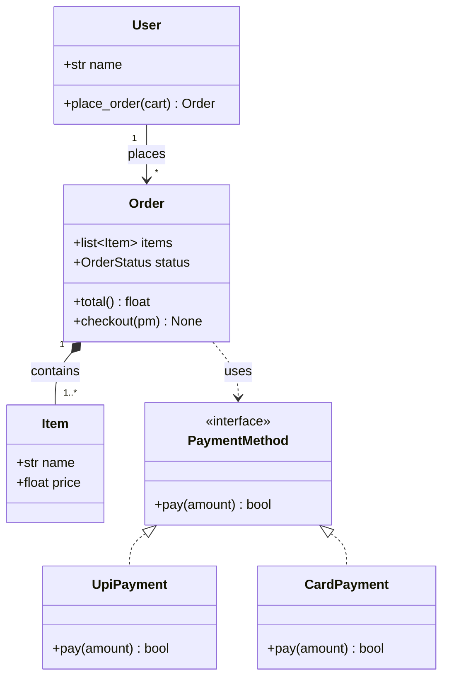
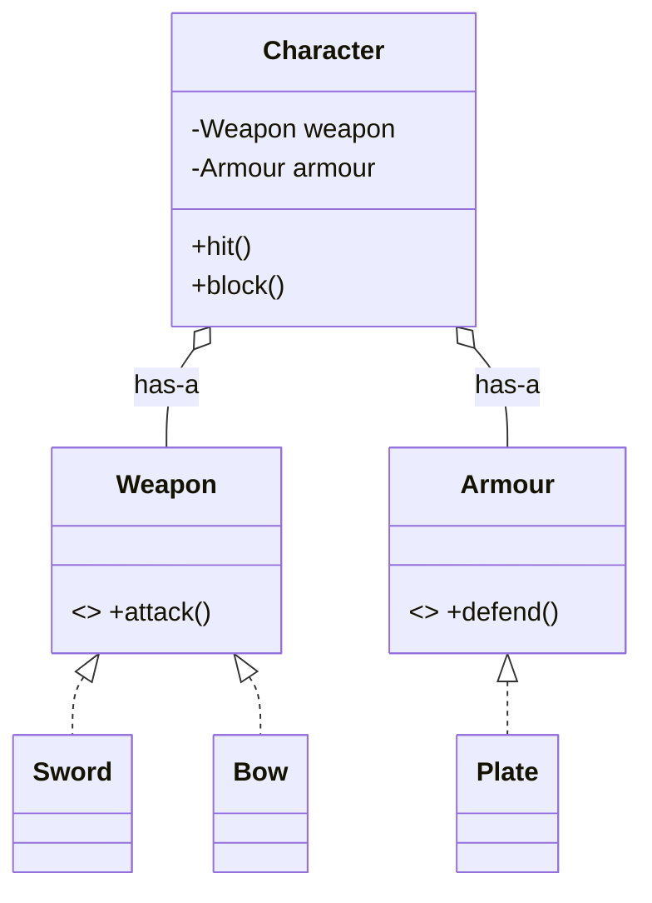
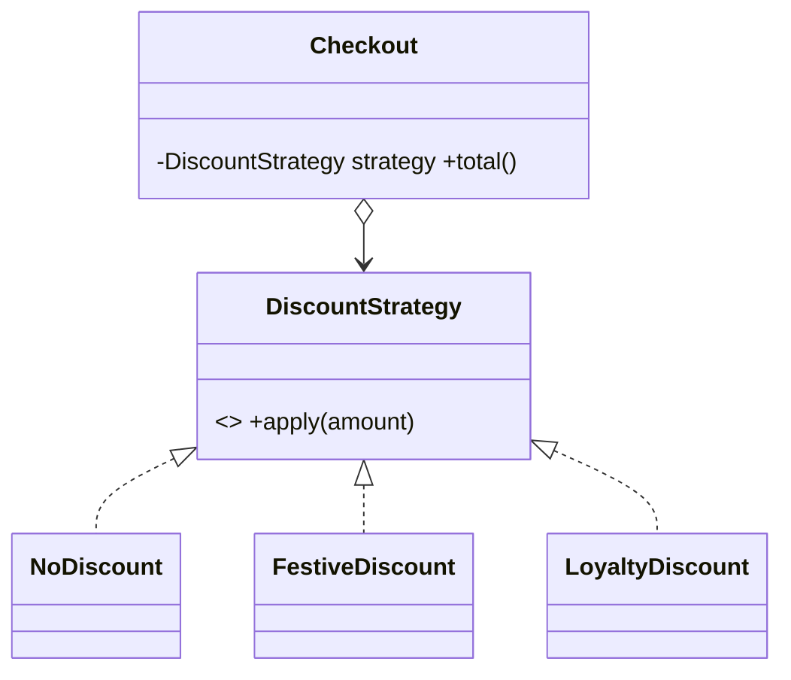
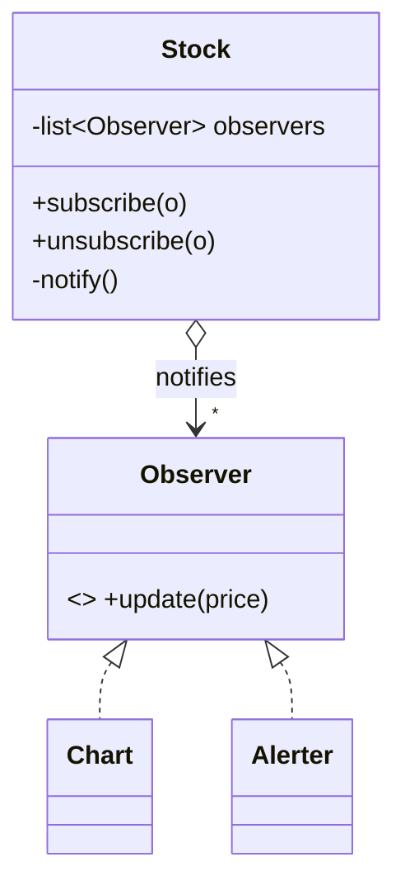
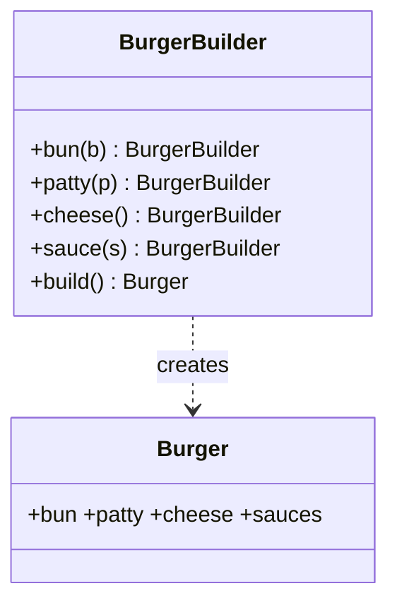
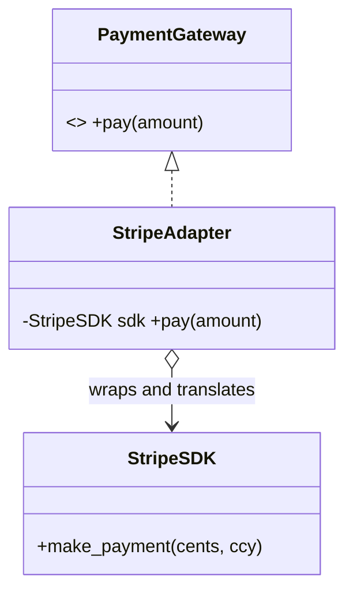
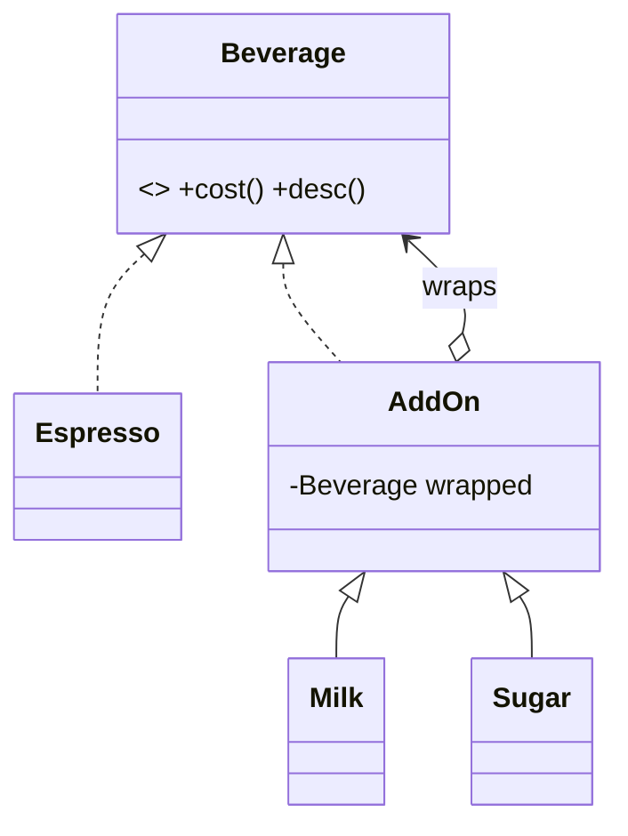
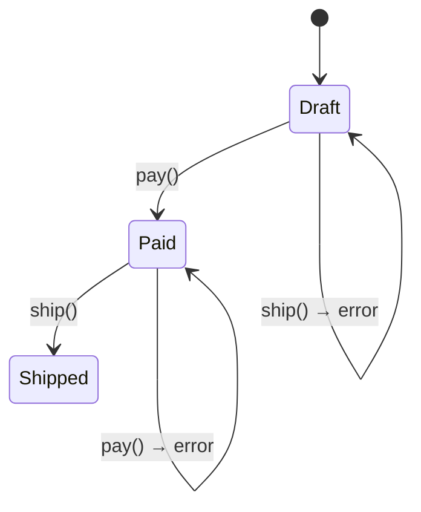
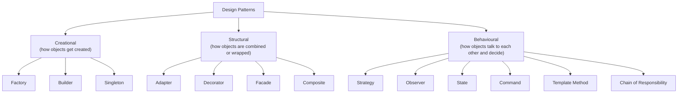

# Low-Level Design (LLD) — Study Notes

**Low-Level Design (LLD)** means: taking a feature described in plain English and turning
it into actual classes — deciding what each class holds, what it does, and how the
classes connect to each other.

These notes cover how to think about that, the principles that keep classes easy to
change, and the design patterns that show up most in real code.

**How every design pattern below is explained** (same four steps each time):

1. **The problem** — what situation you're in.
2. **The ugly ways** — approaches that *look* like they'd work but cause pain later.
3. **The pattern** — the clean solution.
4. **Why it works** — what pain it removes.

Code is in Python. Where Python has a simpler shortcut than the "textbook" version, that
is called out too.

A couple of terms used throughout, defined once here:

- **Object-Oriented Programming (OOP):** a style of coding where you bundle data and the
  functions that work on it into "objects" (created from classes).
- **Coupling:** how tightly two pieces of code depend on each other. *Loose* coupling
  (little dependence) is good — you can change one piece without breaking the other.
  *Tight* coupling is risky.
- **Interface (a "contract"):** a list of methods that a class promises to provide,
  without saying how. Other code can rely on the contract and not care which specific
  class fulfils it.
- **Code smell:** a sign in the code that something is likely to become a maintenance
  problem — not a bug yet, but a warning.

---

## Table of Contents

1. [How to think about a design](#1-how-to-think-about-a-design)
2. [SOLID — five principles for easy-to-change classes](#2-solid--five-principles-for-easy-to-change-classes)
3. [Composition over inheritance](#3-composition-over-inheritance)
4. [Design patterns](#4-design-patterns) — *each one now includes how to spot it in an interview + practice questions*
   - [Strategy](#41-strategy)
   - [Factory](#42-factory)
   - [Observer](#43-observer)
   - [Singleton](#44-singleton)
   - [Builder](#45-builder)
   - [Adapter](#46-adapter)
   - [Decorator](#47-decorator)
   - [State](#48-state)
   - [Facade](#49-facade)
   - [Command](#410-command)
   - [Template Method](#411-template-method)
   - [Composite](#412-composite)
   - [Chain of Responsibility](#413-chain-of-responsibility)
5. [Pattern cheat-sheet + how to pick one](#5-pattern-cheat-sheet--how-to-pick-one)
6. [Appendix A — solutions to all practice questions](#appendix-a--solutions-to-all-practice-questions)

---

## 1. How to think about a design

The whole job is turning a fuzzy English requirement into **classes, what each one is
responsible for, and how they connect**. Here is a repeatable four-step recipe:

```
Requirement (plain English)
      │
      ▼
①  ENTITIES         →  find the nouns    (what "things" exist?)
      │
      ▼
②  RELATIONSHIPS    →  how do the nouns connect?  (owns / is-a / uses)
      │
      ▼
③  RESPONSIBILITIES →  find the verbs    (what does each thing DO?)
      │
      ▼
④  INTERFACES       →  lock the contracts (what can be done in more than one way?)
```

### Step ① Entities — the nouns

Read the requirement and underline every noun. Each noun becomes either a class, an
attribute (a simple value inside a class), or gets dropped as unimportant.

> "A **user** places an **order** containing **items**, and **pays** using a
> **payment method**."

Nouns: `User`, `Order`, `Item`, `PaymentMethod`. The word "pays" is a verb, so it is
something an object *does* (a responsibility), not a thing that exists.

**Quick test:** if a noun has its own data *and* its own behaviour, make it a class. If
it is only a value (a name, a price), it is just an attribute inside another class.

### Step ② Relationships — how the nouns connect

To draw classes and their connections, people use a standard picture notation called
**Unified Modeling Language (UML)**. You only need five kinds of connection:

| Connection | What it means | The test to identify it | Everyday example |
|---|---|---|---|
| **Inheritance** ("is-a") | one class is a special kind of another | "Is X a type of Y?" | a `Dog` *is a* kind of `Animal` |
| **Composition** ("owns", strong) | the part cannot exist without the whole | "If the whole is destroyed, is the part destroyed too?" → **yes** | a `Room` belongs to a `House` (no house, no room) |
| **Aggregation** ("has", weak) | the part can exist on its own | Same test → **no** | a `Player` on a `Team` (player still exists if team disbands) |
| **Association** ("uses"/"knows") | one class simply holds a reference to another | neither owns the other, they just interact | an `Order` knows its `Customer` |
| **Dependency** (temporary use) | one class uses another only inside a method | used briefly, not stored | an `Order` uses a `PricingService` to calculate once |

The one people mix up is **composition vs aggregation**, and the only difference is
lifetime: *if you delete the whole, does the part die with it?* Yes → composition. No →
aggregation.

You also mark **how many** on each end: `1` (exactly one), `0..1` (zero or one),
`1..*` (one or more), `*` (any number). Example: one `Order` has `1..*` `Item`s.

### Step ③ Responsibilities — the verbs

For each class, ask: *"what is this class responsible for — and nothing else?"*

A handy tool is a **Class-Responsibility-Collaborator (CRC) card** — a small note listing
the class's name, what it is responsible for, and which other classes it works with:

```
┌─────────────────────────────────────────────┐
│ Class: Order                                 │
├──────────────────────────┬──────────────────┤
│ Responsible for          │ Works with        │
│ - holding the line items │ - Item            │
│ - calculating the total  │ - PaymentMethod   │
│ - tracking its status    │                   │
└──────────────────────────┴──────────────────┘
```

If a class's "responsible for" list keeps needing the word **"and"**, it is probably
doing too much. That idea has a name — the **Single Responsibility Principle (SRP)** —
covered in Section 2.

### Step ④ Interfaces — lock the contracts

Wherever a job could be done *in more than one way*, hide it behind a **contract**
(an interface). In Python this is written as an **Abstract Base Class (ABC)** — a class
that just lists the required methods, leaving the actual code to each specific class.

Doing this is what lets you swap in a different implementation later without editing the
code that calls it. (Those are the ideas behind the **Open/Closed Principle (OCP)** and
**Dependency Inversion Principle (DIP)**, both in Section 2.)

> "pay using a payment method" → there are many payment methods →
> define a `PaymentMethod` contract with a `pay(amount)` method, then let `UpiPayment`
> and `CardPayment` each provide their own version.

Here is everything above as one class diagram:



**How to read the arrows** (this legend applies to every class diagram in these notes):

| Symbol in the diagram | Meaning |
|---|---|
| line with a hollow triangle `<|..` or `<|--` | "is a" / "provides this contract" (inheritance / implements an interface) |
| line with a filled diamond `*--` | "owns" — the part dies with the whole (composition) |
| line with a hollow diamond `o--` | "has" — the part can live on its own (aggregation) |
| plain arrow `-->` | "knows / uses" (association) |
| dotted arrow `..>` | "uses temporarily inside a method" (dependency) |

**Checklist before you write any code:**

1. Have I listed the nouns? (entities)
2. Is each connection labelled *is-a*, *owns/has*, or *uses*? (relationships)
3. Does each class have one clear job? (responsibilities)
4. Is anything that has more than one possible implementation hidden behind a contract?
   (interfaces)

---

## 2. SOLID — five principles for easy-to-change classes

**SOLID** is just a memory aid: each letter is the first letter of one principle. All
five push toward the same goal — **when requirements change, you should only have to edit
a small local piece of code, not rewrite half the system.**

| Letter | Full name | In plain English |
|---|---|---|
| **S** | Single Responsibility Principle (SRP) | One class should do one job (have one reason to change). |
| **O** | Open/Closed Principle (OCP) | Add new behaviour by writing new code, not by editing working code. |
| **L** | Liskov Substitution Principle (LSP) | A child class must work correctly anywhere its parent is expected. |
| **I** | Interface Segregation Principle (ISP) | Prefer several small, focused contracts over one big catch-all contract. |
| **D** | Dependency Inversion Principle (DIP) | Depend on a general contract, not on one specific class. |

The detail for each, with the smallest possible example:

### S — Single Responsibility Principle (SRP)
**One job per class (one reason to change).** Here "DB" means **database**.

```python
# ❌ this class has TWO jobs: business logic AND saving to the database.
#    A change to how we store data forces edits to this class.
class Invoice:
    def total(self): ...
    def save_to_db(self): ...

# ✅ separate the two reasons to change
class Invoice:
    def total(self): ...

class InvoiceRepository:      # database work lives here, on its own
    def save(self, invoice): ...
```

### O — Open/Closed Principle (OCP)
**Add behaviour by adding new code, not by editing old code.**

```python
# ✅ a new shape means a new class. The total_area function is never touched again.
class Shape:
    def area(self) -> float: ...

class Circle(Shape):
    def area(self): return 3.14 * self.r ** 2

class Square(Shape):
    def area(self): return self.s ** 2

def total_area(shapes):
    return sum(s.area() for s in shapes)   # works for shapes that don't exist yet
```

### L — Liskov Substitution Principle (LSP)
**A child class must behave correctly wherever the parent is used** — no nasty surprises.

```python
# ❌ Penguin is declared a Bird, but breaks the promise that a Bird can fly.
#    Any code that calls bird.fly() will crash when handed a Penguin.
class Bird:
    def fly(self): ...
class Penguin(Bird):
    def fly(self): raise Exception("can't fly")

# ✅ model the real capability instead of forcing a false "is-a"
class Bird: ...
class FlyingBird(Bird):
    def fly(self): ...
class Penguin(Bird): ...     # simply has no fly() method — no broken promise
```

### I — Interface Segregation Principle (ISP)
**Many small contracts beat one giant contract.** A class should not be forced to
provide methods it has no use for.

```python
# ❌ one big contract forces a class to implement things it can't do
class Machine:
    def print(self): ...
    def scan(self): ...
    def fax(self): ...
class OldPrinter(Machine):
    def scan(self): raise NotImplementedError   # it can't scan!

# ✅ split the contract by capability
class Printer:
    def print(self): ...
class Scanner:
    def scan(self): ...
class AllInOne(Printer, Scanner): ...   # takes on only what it can actually do
```

### D — Dependency Inversion Principle (DIP)
**Depend on a general contract, not on one specific class** — so you can swap the
specific class later.

```python
# ❌ Notifier is locked to one concrete sender; you can't switch to SMS without editing it
class Notifier:
    def __init__(self):
        self.sender = EmailSender()

# ✅ pass the contract in from outside; Notifier no longer cares which sender it gets
class MessageSender:              # the general contract
    def send(self, msg): ...
class Notifier:
    def __init__(self, sender: MessageSender):
        self.sender = sender
```

> **Why SOLID matters for the rest of these notes:** OCP ("add, don't edit") and DIP
> ("depend on a contract") are the engine behind almost every design pattern below.
> Strategy, Factory, Observer, State — they all work by making the main code depend on a
> contract and then swapping the specific piece behind it.

---

## 3. Composition over inheritance

**The idea:** prefer building an object out of smaller objects it *holds* ("has-a")
rather than extending a parent class ("is-a") — unless there is a genuine "is-a" that
also passes the Liskov test from Section 2.

### Why leaning on inheritance bites you

Inheritance is the **strongest form of coupling** in OOP — the child is stuck tightly to
the parent's inner workings, so a change in the parent easily breaks the child. Two
classic failures:

**1. Too many combinations → too many classes.**
Say a game `Character` can carry a weapon and wear armour. If you try to cover every
combination with inheritance:

```
Character
 ├─ SwordCharacter
 ├─ BowCharacter
 ├─ SwordPlateCharacter
 ├─ BowPlateCharacter
 ├─ SwordLeatherCharacter
 └─ ... every new option multiplies the number of classes  😵
```

**2. A change in the parent secretly breaks the child.**
Imagine making a `Stack` (last-in-first-out) by extending a general `List`. The `Stack`
now *inherits* a "insert into the middle" method from `List` — which makes no sense for a
stack, but nothing stops someone from calling it. The "is-a" was a lie.

### The composition fix

Give the character *fields* that hold behaviour objects, instead of building the behaviour
into the class hierarchy:

```python
class Weapon:                       # each behaviour is its own object
    def attack(self) -> int: ...
class Sword(Weapon):
    def attack(self): return 10
class Bow(Weapon):
    def attack(self): return 7

class Armour:
    def defend(self) -> int: ...
class Plate(Armour):
    def defend(self): return 8

class Character:                    # a Character HAS a weapon and HAS armour
    def __init__(self, weapon: Weapon, armour: Armour):
        self.weapon = weapon
        self.armour = armour
    def hit(self):   return self.weapon.attack()
    def block(self): return self.armour.defend()

hero = Character(Sword(), Plate())   # mix and match freely
hero.weapon = Bow()                  # you can even swap gear while the game runs
```

Now `n` weapons and `m` armours need **n + m classes**, not `n × m`. And you can change
the loadout while the program is running — something inheritance cannot do.



*How to read it:* the hollow diamond means "Character **has a** Weapon / Armour"; the
hollow-triangle lines mean Sword and Bow **provide** the Weapon contract.

**When inheritance is still the right choice:** when there is a true, stable "is-a" and
the child works correctly everywhere the parent does (Liskov passes) — for example a
`Circle` genuinely *is a* `Shape`. A useful rule of thumb: **inherit a contract, but
hold behaviour as a field (compose it).**

> Nearly every pattern in Section 4 is composition underneath. Strategy = hold a
> behaviour object. Decorator = hold a wrapped object. State = hold the current-state
> object. Once composition clicks, the patterns feel like the same move repeated.

---

## 4. Design patterns

Reminder of the four-step format for each: **the problem → the ugly ways → the pattern →
why it works.** Read the "ugly ways" part even for patterns you know — spotting the smell
is what tells you *when* to use the pattern.

**How to attack any "design this" question in an interview** (a game plan you run out loud):

1. **Repeat and clarify.** Say the problem back in one line, then ask 2–3 scoping
   questions (How big is it? Which features are in scope? Mostly reading or writing?).
   This buys thinking time and shows maturity.
2. **Find the nouns → classes.** Use the Section 1 recipe: nouns become classes, verbs
   become methods.
3. **Find what varies.** Ask: *"which part is most likely to change, or comes in several
   flavours?"* That varying part is almost always where a pattern goes.
4. **Match the variation to a pattern** using the *"Spot it in an interview"* box under
   each pattern below. Say the pattern name **and the reason**.
5. **Draw the classes and interfaces, then code the core** — the interface plus one or
   two concrete classes plus the object that uses them. Don't code everything; code the
   interesting part.
6. **Call out trade-offs and extensions yourself** (thread-safety, testing, scaling)
   before the interviewer asks. That is what separates a senior answer.

**Golden rule: never name a pattern first.** Describe the problem, point at the smell,
*then* introduce the pattern as the fix. Leading with "let's use Strategy" before showing
why sounds rehearsed; earning it sounds like engineering.

---

### 4.1 Strategy

**The problem.** You have one job whose *method can vary* — for example a discount
calculation, a route planner, a file-compression method, or a sorting rule. The right
method depends on the situation, or needs to switch while the program runs.

**The ugly ways.**
```python
# 😖 one giant "if" chain. It grows forever, one class ends up doing five jobs,
#    and each new discount forces you to edit this method (breaking Open/Closed).
class Checkout:
    def total(self, cart, kind):
        if kind == "none":      return cart.sum()
        elif kind == "festive": return cart.sum() * 0.8
        elif kind == "loyalty": return cart.sum() - 100
        elif kind == "bank":    ...
```
Also ugly: making a separate `Checkout` subclass for every discount (too many classes),
or a pile of true/false flags (`is_festive`, `is_loyalty`, …) that can end up
contradicting each other.

**The pattern.** Pull each varying method out into its own small object that follows a
shared contract, then hand the chosen one to the main object. The main object is usually
called the **context** (the object that holds and uses the strategy).

```python
from abc import ABC, abstractmethod

class DiscountStrategy(ABC):              # the shared contract
    @abstractmethod
    def apply(self, amount: float) -> float: ...

class NoDiscount(DiscountStrategy):
    def apply(self, amount): return amount
class FestiveDiscount(DiscountStrategy):
    def apply(self, amount): return amount * 0.8
class LoyaltyDiscount(DiscountStrategy):
    def apply(self, amount): return amount - 100

class Checkout:                           # the context
    def __init__(self, strategy: DiscountStrategy):
        self.strategy = strategy
    def total(self, cart):
        return self.strategy.apply(cart.sum())   # it delegates; it doesn't decide

Checkout(FestiveDiscount()).total(cart)   # swap in a different strategy → new behaviour
```

**Why it works.**
- **Add, don't edit:** a new discount is a new class; `Checkout` never changes.
- **Switch while running:** set `checkout.strategy = LoyaltyDiscount()` any time.
- **Easy to test:** each strategy is a tiny piece you can test on its own.
- The giant "if" chain and the flag mess both disappear.



**Looks similar to… (and the thin line).**
Strategy and **State** are built the *exact same way* — a main object (the context) holds
one object behind a contract and hands the work to it. This is the single most confused
pair in design patterns.

| Confused with | Why they look alike | The deciding difference (quick rule) |
|---|---|---|
| **State** | Both hold a swappable object behind a contract and delegate to it; both remove big `if` chains. | In State, the held objects *decide the next object themselves* (a stage moves to another stage) and follow a lifecycle. In Strategy, the object is *handed in from outside*, the strategies don't know about each other, and it usually doesn't change on its own. **Ask: does the held object choose what comes next? Yes → State. No → Strategy.** |
| **Command** *(not covered in these notes)* | Both wrap an action as an object you pass around. | A Strategy *is an interchangeable way to do a task*; a Command *is a recorded request* meant to be queued, logged, or undone. The purpose differs, not the shape. |

**Python shortcut.** In Python, functions are ordinary values you can pass around like
objects. So a strategy is often just a function — no contract class needed:
```python
def festive(amount): return amount * 0.8

class Checkout:
    def __init__(self, discount):        # discount is any function
        self.discount = discount
    def total(self, cart):
        return self.discount(cart.sum())

Checkout(festive)
```

**Spot it in an interview.**
- The prompt describes **several ways to do the same job** (many pricing rules, many
  payment methods, many sorting or matching rules).
- You can **switch the method while running**, or "choose based on the user or config."
- Keyword tells: *"depending on…", "different types of…", "the user selects…",
  "pluggable", "configurable".*
- Smell you're removing: a growing `if / elif` on a "kind" value inside one method.

**How to design it (quick steps).**
1. Find the one action that varies; make it an interface with a single method.
2. Each variation becomes its own small class implementing that method.
3. The main object (the *context*) keeps a strategy and a way to swap it.
4. The context calls the strategy instead of deciding itself.

**Practice (solutions in Appendix A).**
1. **[S1]** Design the fare calculator for a ride app supporting *normal*, *surge*, and
   *night* pricing, switchable without redeploying.
   *Follow-up:* Add a promo that gives 10% off *on top of* whatever pricing is active.
   Does Strategy still fit, or do you need another pattern?
2. **[S2]** Design checkout payment supporting UPI, card, and wallet, with more methods
   added later.
   *Follow-up:* Some methods need an OTP step and some don't — where does that logic live
   so you never write `if method == …`?

---

### 4.2 Factory

**The problem.** Creating an object is messy: which specific class to build depends on
input decided while the program runs, or the creation involves logic you don't want
copy-pasted all over the codebase. You want callers to say "give me a parser for this
file" without knowing the specific classes.

**The ugly ways.**
```python
# 😖 the same creation logic copy-pasted at every place that needs it, and every caller
#    has to know about every specific class. Add a new format → hunt down all the copies.
if ext == "csv":    parser = CsvParser()
elif ext == "json": parser = JsonParser()
elif ext == "xml":  parser = XmlParser()
```
Also ugly: a constructor that secretly runs a big "if" to turn itself into different
things, or creating specific classes directly everywhere (tight coupling, breaks DIP).

**The pattern.** Put creation in one place. A specific implementation is called a
**concrete class** (as opposed to the general contract). Two common forms:

**(a) Simple Factory** — one function (or method) that returns the right object:
```python
from abc import ABC, abstractmethod

class Parser(ABC):
    @abstractmethod
    def parse(self, text): ...
class CsvParser(Parser):
    def parse(self, text): ...
class JsonParser(Parser):
    def parse(self, text): ...

def parser_for(ext: str) -> Parser:       # the single place that knows how to create
    return {"csv": CsvParser, "json": JsonParser}[ext]()

parser = parser_for("csv")                # the caller never names a specific class
```

**(b) Factory Method** — a parent class defines a "create this for me" step, and each
child class fills in which specific object to make. Use this when the *creator itself*
comes in variants:
```python
class Dialog(ABC):
    @abstractmethod
    def create_button(self): ...          # the "make me a button" step
    def render(self):
        btn = self.create_button()        # parent uses the button without naming its type
        btn.draw()

class WindowsDialog(Dialog):
    def create_button(self): return WindowsButton()
class WebDialog(Dialog):
    def create_button(self): return HtmlButton()
```

> There is also **Abstract Factory** — a factory that creates a whole *family* of
> matching objects at once (for example, one that makes a matching button + checkbox +
> menu, all in the same visual style). Same idea, one level bigger.

**Why it works.**
- One place to update when a new type appears (no scattered copies to fix).
- Callers depend on the general `Parser` contract, not on specific classes (DIP).
- The messy creation logic is kept in a single spot.

**Looks similar to… (and the thin line).**
Factory is in the same family as **Builder** and **Singleton** — all three stop you from
calling constructors directly, but they answer *different questions*.

| Confused with | Why they look alike | The deciding difference (quick rule) |
|---|---|---|
| **Builder** | Both hide object creation behind a nicer entry point. | Factory answers **"which type do I create?"** and returns it in one call. Builder answers **"how do I assemble this one complex object?"** across several steps. **Many possible types + simple creation → Factory. One type + many steps/options → Builder.** |
| **Singleton** | Both give one central place to obtain an object. | Factory controls **which** object you get (and can make many). Singleton controls **how many exist** (exactly one). A factory can even *return* a singleton — different jobs. |

Also don't confuse the three Factory forms shown above with each other: **Simple Factory**
= one function that picks the type; **Factory Method** = a child class fills in the type;
**Abstract Factory** = creates a whole matching *family* of objects at once.

**Python shortcut.** You rarely need the full parent/child version — a dictionary or a
function (form **a**) covers most cases. A neat trick is letting each class **register
itself**:
```python
REGISTRY = {}
def register(name):
    def wrap(cls):
        REGISTRY[name] = cls
        return cls
    return wrap

@register("csv")
class CsvParser(Parser): ...

def parser_for(ext): return REGISTRY[ext]()   # new parsers plug in; the factory is untouched
```

**Spot it in an interview.**
- You receive a **type / name / config value and must build the matching object**
  (parsers per file type, handlers per event, drivers per database).
- New types are expected to be added over time.
- Keyword tells: *"based on the type…", "create the right…", "support multiple
  providers/formats", "plugin".*
- Smell you're removing: `SpecificClass()` creation decisions copy-pasted across files.

**How to design it (quick steps).**
1. Give all the products one common interface.
2. Put the "which class to create" decision in **one** factory function or class.
3. Callers ask the factory; they never build concrete classes directly.
4. (Nice touch) Let classes register themselves, so adding one needs no factory edits.

**Practice (solutions in Appendix A).**
1. **[F1]** Design a notification service that sends via Email, SMS, or Push, chosen by a
   channel string from config.
   *Follow-up:* Adding a new channel (say WhatsApp) should need **zero** edits to existing
   code. How?
2. **[F2]** Design a document parser that returns the correct parser for `.csv`, `.json`,
   `.xml`.
   *Follow-up:* How do you support parsers that arrive as third-party plugins loaded at
   runtime?

---

### 4.3 Observer

**The problem.** When one object changes, a *group of other objects* needs to react — but
you don't know how many, and you don't want the changing object hard-wired to all of
them. Examples: a stock price updating several dashboards; a spreadsheet cell refreshing
charts that depend on it; a training loop reporting metrics to several loggers.

**The ugly ways.** ("CPU" below means **Central Processing Unit** — the processor that
runs your code.)
```python
# 😖 the source hard-codes every listener. To add one more, you must edit the source
#    (breaking Open/Closed), and it now depends on all of them.
class Stock:
    def set_price(self, p):
        self.price = p
        chart.update(p); logger.log(p); alerter.check(p)
```
Also ugly: **polling** — every listener sits in a loop constantly re-checking "did it
change yet?", which wastes CPU and is always a little out of date.

**The pattern.** The changing object (the **subject**) keeps a list of **observers**,
each following a shared `update()` contract. When it changes, it notifies all of them.
Observers can join or leave the list at any time.

```python
class Observer:
    def update(self, price: float): ...

class Stock:                                   # the subject
    def __init__(self):
        self._observers: list[Observer] = []
        self._price = 0.0
    def subscribe(self, o):   self._observers.append(o)
    def unsubscribe(self, o): self._observers.remove(o)
    def _notify(self):
        for o in self._observers:
            o.update(self._price)              # tell everyone; it doesn't care who they are
    @property
    def price(self): return self._price
    @price.setter
    def price(self, p):
        self._price = p
        self._notify()

class Chart(Observer):
    def update(self, price): print(f"chart → {price}")
class Alerter(Observer):
    def update(self, price):
        if price > 100: print("ALERT!")

stock = Stock()
stock.subscribe(Chart())
stock.subscribe(Alerter())
stock.price = 120      # both react automatically
```

**Why it works.**
- **Loose coupling:** the subject only knows the `Observer` contract, nothing more.
- **Add, don't edit:** attach a new listener without touching the subject.
- **Flexible:** observers join or leave while the program runs; one change can update
  many listeners at once.



**Looks similar to… (and the thin line).**
Among the eight patterns here, Observer has no structural twin — its closest cousins live
outside these notes.

| Confused with | Why they look alike | The deciding difference (quick rule) |
|---|---|---|
| **Mediator** *(not covered in these notes)* | Both cut down direct connections between objects. | Observer is a **one-way broadcast**: a subject tells many listeners "I changed." Mediator is a **hub** that coordinates two-way back-and-forth among many peers. |
| **Publish–Subscribe** *(a looser variant of Observer)* | Both notify many listeners on an event. | In plain Observer the subject *directly holds* its observers. In Pub–Sub a broker sits in the middle, so publishers and subscribers never know each other. |
| **Strategy** | Both are often coded by "passing in a function." | A Strategy is **one function that is the algorithm**; Observers are **many functions called whenever something changes**. Same surface (callbacks), opposite intent. |

**Python shortcut.** Observers can just be plain functions (callbacks). This is exactly
how "publish–subscribe" systems and event handlers work. Two things to watch out for:
1. **Memory not being freed:** if the subject holds on to every observer forever, those
   observer objects can never be cleaned out of memory, even after you're done with them.
2. **An observer changing the subject mid-notify:** for example an observer that
   unsubscribes itself or updates the price from inside its own `update()`. This causes
   confusing bugs — keep `update()` methods simple.

**Spot it in an interview.**
- **One thing changes and many things must react or update**, and the list of reactors
  can grow.
- Words like *subscribe, publish, notify, listener, real-time, keep in sync, live update*.
- Examples: stock ticker, chat broadcast, dashboards, "notify subscribers on new upload."
- Smell you're removing: the changing object hardcoding a call to every dependent.

**How to design it (quick steps).**
1. The changing object (the *subject*) keeps a list of observers + `subscribe / unsubscribe`.
2. Observers share an `update()` method (an interface).
3. On change, the subject loops through the list and calls `update()` on each.
4. Decide **push** (send the new data) vs **pull** (observer asks for it).

**Practice (solutions in Appendix A).**
1. **[O1]** Design a stock-price service where several displays and an alert service
   update live whenever a price changes.
   *Follow-up:* One observer is slow — it must not block the others. How do you handle it?
2. **[O2]** Design channel subscriptions where subscribers are notified on each new upload.
   *Follow-up:* With millions of subscribers, is in-process Observer enough? If not, what
   replaces the observer list?

---

### 4.4 Singleton

**The problem.** You need *exactly one* shared instance of something — a configuration
object, a database connection pool, a logger, a cache — and one easy way to reach it from
anywhere.

**The ugly ways.**
```python
# 😖 a loose global: nothing stops a second one being made, and it's unclear when/where
#    it first gets set up.
config = {}

# 😖 or: passing the same object down through 12 layers of function calls just so the
#    bottom layer can use it — clutters every function signature in between.
```
The mistake people also make: creating the connection pool separately in five different
files → five pools, five sets of connections, quietly using up resources.

**The pattern.** Control creation so that asking for the object again gives back the
*same* one.

```python
class Singleton:
    _instance = None
    def __new__(cls, *args, **kwargs):
        if cls._instance is None:
            cls._instance = super().__new__(cls)
        return cls._instance

a = Singleton()
b = Singleton()
assert a is b        # both names point to the same object
```

**Why it works.** It guarantees one shared instance with one point of access, and it
creates that instance only when it is first needed.

**⚠️ Important — Singleton is the most over-used pattern. Read this before using it.**
- It is really just a **global variable in disguise**. Global variables are risky
  because: any code anywhere can change the shared object (so a bug in one place shows up
  mysteriously in another); the dependency is hidden (it doesn't appear in a function's
  parameters); and tests interfere with each other, because the single instance carries
  leftover state from one test into the next.
- **Multiple threads:** if two threads reach the `if _instance is None` check at the same
  instant, both can see "nothing yet" and each create one — so you get two. Fixing this
  needs a lock (a guard that lets only one thread through at a time). The simplest fix is
  to create the instance once when the program starts.
- It also bends two SOLID principles: the class now manages both its real job *and* its
  own creation (against SRP), and callers grab a specific global object instead of
  receiving a swappable contract (against DIP).

**Looks similar to… (and the thin line).**

| Confused with | Why they look alike | The deciding difference (quick rule) |
|---|---|---|
| **Factory** | Both are creational and give a central way to get an object. | Singleton limits **how many** instances exist (one). Factory decides **which/what** to build (any number). Entirely different questions. |
| **Monostate / "Borg"** *(a Singleton variant)* | Behaves like a Singleton from the outside. | Instead of allowing only one instance, it lets you create **many instances that all share the same state**. Looks different (many objects), acts the same (one shared state). Worth recognising, rarely needed. |

**Python shortcut — usually you should just use a module.** In Python, a module (a `.py`
file) is loaded only once and then reused everywhere it is imported. So a module already
*is* a single shared thing, with no extra code:
```python
# config.py
settings = {}
def get(key): return settings[key]

# anywhere else:
# from config import settings   → the same 'settings' object every time
```
Reach for a real Singleton class only when you need to delay creation until first use, or
to allow subclassing. Otherwise, prefer **passing the one instance in** (which keeps tests
easy).

**Spot it in an interview.**
- The prompt insists on **exactly one shared instance** (one config, one connection pool,
  one logger, one cache, one ID generator).
- Words like *single, global, shared, one instance*.
- **Careful:** interviewers usually follow up on the downsides — be ready to defend it or
  choose dependency injection instead.

**How to design it (quick steps).**
1. First ask: do we *truly* need one, or can we just pass one object around? (Passing is
   usually better.)
2. If yes, control creation so repeated requests return the same object.
3. Provide one clear access point.
4. Make it safe when several threads start at once (create it at import time, or use a lock).
5. In Python, a module-level object is the simplest singleton.

**Practice (solutions in Appendix A).**
1. **[SG1]** Design a thread-safe configuration manager loaded once from a file and
   readable everywhere.
   *Follow-up:* It's global, so tests interfere with each other. How do you keep it
   testable?
2. **[SG2]** Design a database connection pool as a single shared instance.
   *Follow-up:* The interviewer asks, "Isn't Singleton an anti-pattern? When would you
   avoid it?" What's your answer?

---

### 4.5 Builder

**The problem.** Creating an object takes several steps, or has many optional parts, or
needs checking that only makes sense once everything is set. Examples: building a web
request, assembling a database query (a query written in **Structured Query Language,
SQL**), or making a `Burger` with many optional toppings.

**The ugly ways.**
```python
# 😖 a constructor with more and more parameters piled on, half of them left as None.
#    Nobody can tell what the arguments mean at the call site.
Burger("beef", True, False, True, None, "large", False, True)   # what is argument #5?

# 😖 or many slightly-different constructors, or a dozen "set this" calls with no checking,
#    leaving the object usable while it's still half-built and invalid.
```

**The pattern.** A **builder** collects the pieces one step at a time, then produces the
finished, checked object in a single `build()` call. Each step returns the builder
itself, so you can chain the calls one after another — this chaining style is called a
**fluent** interface.

```python
from dataclasses import dataclass

@dataclass(frozen=True)          # 'frozen' = immutable = can't be changed once created
class Burger:
    bun: str
    patty: str
    cheese: bool
    sauces: tuple

class BurgerBuilder:
    def __init__(self):
        self._bun = "regular"; self._patty = "veg"
        self._cheese = False;  self._sauces = []
    def bun(self, b):    self._bun = b;          return self   # returns self → chainable
    def patty(self, p):  self._patty = p;        return self
    def cheese(self):    self._cheese = True;    return self
    def sauce(self, s):  self._sauces.append(s); return self
    def build(self) -> Burger:
        # check the fields make sense together, before creating the object
        if self._patty == "veg" and "bacon" in self._sauces:
            raise ValueError("a veg burger can't have bacon")
        return Burger(self._bun, self._patty, self._cheese, tuple(self._sauces))

burger = (BurgerBuilder()
          .bun("sesame").patty("beef").cheese()
          .sauce("mayo").sauce("bbq")
          .build())
```

**Why it works.**
- The construction reads clearly (`.cheese()` is obvious; a bare `True` is not).
- The finished object can be **immutable** and only ever exists in a valid state, because
  all the checking happens in `build()`.
- It separates *how* the object is assembled from *what* the object is.



**Looks similar to… (and the thin line).**

| Confused with | Why they look alike | The deciding difference (quick rule) |
|---|---|---|
| **Factory** | Both replace direct constructor calls. | Factory picks **which type** in one step; Builder assembles **one complex object** over many steps. **Choosing a type → Factory. Assembling a complicated object → Builder.** |
| **Decorator** | The chained `.a().b().c()` calls look alike. | A Builder's chain only *configures*, then `build()` produces the finished object — the builder itself isn't the product. A Decorator's chain *is* the product: each wrapper is already usable and adds real behaviour at runtime. |

**Python shortcut.** Python lets you name arguments and give them defaults, which removes
most "too many parameters" pain on its own:
```python
@dataclass
class Burger:
    bun: str = "regular"
    patty: str = "veg"
    cheese: bool = False

Burger(patty="beef", cheese=True)     # clear enough; no builder needed here
```
So use a real builder mainly when there are **ordered steps, checks across several fields,
or more than one possible finished form** — not just to avoid positional arguments.

**Spot it in an interview.**
- Creating an object has **many optional parts** or **several steps**, or needs checks
  once everything is set.
- Examples: query builder, HTTP request builder, pizza/meal customizer, report assembler.
- Keyword tells: *"lots of optional fields", "step by step", "customizable", "configure
  then create".*
- Smell you're removing: a constructor that would take many parameters, half optional.

**How to design it (quick steps).**
1. List the product's parts: required vs optional.
2. Make a builder with one small method per part; each returns `self` so calls chain.
3. Do validation and final assembly inside `build()`.
4. Make the finished product read-only (can't be changed after building).

**Practice (solutions in Appendix A).**
1. **[B1]** Design a search-query builder (optional filters, sort, and pagination) for an
   API.
   *Follow-up:* Some combinations are invalid (e.g., "sort by a field you didn't
   request"). Where do you catch that?
2. **[B2]** Design a pizza customizer for a food-ordering app (size, crust, many toppings).
   *Follow-up:* Support named presets like "Veggie Deluxe" that pre-fill the builder. How
   do you structure that?

---

### 4.6 Adapter

**The problem.** You have an existing class — often from an outside library — whose method
names don't match what your code expects, and you *can't* (or shouldn't) change it. You
need to make it fit. Here "SDK" means **Software Development Kit** — a ready-made library
provided by a company. Classic case: your app expects `.pay(amount)`, but a payment
company's SDK offers `.make_payment(cents, currency)`.

**The ugly ways.**
```python
# 😖 scattering the conversion at every call site — repeated in 20 places, easy to get
#    slightly wrong in one of them
stripe.make_payment(int(amount * 100), "usd")

# 😖 or copying and rewriting the library's class, or editing the library's code at
#    runtime — both break the next time the library updates
```

**The pattern.** Write an **adapter** — a small wrapper that offers *your* expected
method and, inside, translates the call to the library's method. The class being wrapped
is often called the **adaptee** (the thing being adapted). One translation lives in one
place.

```python
# --- the method your app expects ---
class PaymentGateway:
    def pay(self, amount: float) -> bool: ...

# --- the outside library with the mismatched method (the adaptee) ---
class StripeSDK:
    def make_payment(self, cents: int, currency: str) -> dict:
        return {"status": "ok"}

# --- the adapter: speaks YOUR language on the outside, the library's on the inside ---
class StripeAdapter(PaymentGateway):
    def __init__(self, sdk: StripeSDK):
        self._sdk = sdk
    def pay(self, amount: float) -> bool:
        result = self._sdk.make_payment(int(amount * 100), "usd")   # translate here
        return result["status"] == "ok"

def checkout(gateway: PaymentGateway, amount):    # the app knows only the expected method
    gateway.pay(amount)

checkout(StripeAdapter(StripeSDK()), 49.99)
```

**Why it works.**
- You reuse the outside code **without changing it** (and often you *can't* change it).
- The translation sits in **one place** — to switch to a different payment company, you
  write another adapter and leave the app code alone (DIP).



**Looks similar to… (and the thin line).**
Several patterns "wrap" one object inside another, so they're easy to mix up. What
separates them is the wrapper's *purpose*.

| Confused with | Why they look alike | The deciding difference (quick rule) |
|---|---|---|
| **Decorator** | Both hold another object and forward calls to it. | Adapter **changes the method names** so a mismatched class fits, and adds no new behaviour. Decorator **keeps the same methods** and **adds behaviour**. **Making things fit → Adapter. Adding features → Decorator.** |
| **Facade** *(not covered in these notes)* | Both put a friendlier front on existing code. | Adapter converts **one** class's interface into the one you expected. Facade hides a **whole subsystem of many classes** behind one simple interface. |
| **Proxy** *(not covered in these notes)* | Same interface as the wrapped object, like any wrapper. | A Proxy's job is **controlling access** (delay loading, check permissions, stand in for a remote object) — not converting or enriching. |

**Spot it in an interview.**
- You must **use an existing / third-party / legacy class whose method names don't match**
  what your code expects.
- Examples: integrate a payment SDK, swap SMS vendors, unify several external APIs under
  one interface.
- Keyword tells: *"integrate with…", "third-party", "legacy", "make X work with our
  system".*
- Smell you're removing: conversion code (renaming, reshaping) copy-pasted at every call
  site.

**How to design it (quick steps).**
1. Define the interface **your app wants**.
2. Write a wrapper that implements it and holds the foreign object inside.
3. Translate the call (and the data shape) within the wrapper.
4. Your app depends only on your interface, never the foreign class.

**Practice (solutions in Appendix A).**
1. **[A1]** Your app expects `PaymentGateway.pay(amount)`, but you must integrate Razorpay
   and Stripe SDKs, which have different method names.
   *Follow-up:* Switch the active provider from config, and add a new provider with no
   changes to the checkout code. How?
2. **[A2]** Unify three weather APIs (each returns a different JSON shape) behind one
   `WeatherService.get_temp(city)`.
   *Follow-up:* How do you test your adapters without calling the real APIs?

---

### 4.7 Decorator

**The problem.** You want to add extra behaviour to *individual objects*, in any
combination, while the program runs — without creating a class for every possible combo.
Examples: a coffee that can have milk and/or sugar and/or whipped cream; a data source
that you want to wrap with caching, logging, and automatic retries.

**The ugly ways.**
```python
# 😖 a separate class for every combination. The number of classes explodes, and the
#    combinations are fixed in advance.
class Coffee: ...
class CoffeeWithMilk(Coffee): ...
class CoffeeWithMilkAndSugar(Coffee): ...
class CoffeeWithMilkSugarWhip(Coffee): ...
```
Also ugly: a single big class covered in true/false flags (`has_milk`, `has_sugar`, …)
with "if" checks spread through every method.

**The pattern.** Create **decorators** that *wrap* an object, offer the same methods as
that object, and add a little behaviour before or after passing the call through to the
wrapped object. Because a decorator offers the same methods, you can wrap a decorator in
another decorator, stacking them as deep as you like.

```python
from abc import ABC, abstractmethod

class Beverage(ABC):                       # the shared contract
    @abstractmethod
    def cost(self) -> float: ...
    @abstractmethod
    def desc(self) -> str: ...

class Espresso(Beverage):                  # the base object
    def cost(self): return 2.0
    def desc(self): return "espresso"

class AddOn(Beverage):                      # base decorator: it holds a Beverage inside it
    def __init__(self, wrapped: Beverage):
        self._wrapped = wrapped

class Milk(AddOn):
    def cost(self): return self._wrapped.cost() + 0.5
    def desc(self): return self._wrapped.desc() + " + milk"
class Sugar(AddOn):
    def cost(self): return self._wrapped.cost() + 0.2
    def desc(self): return self._wrapped.desc() + " + sugar"

drink = Sugar(Milk(Espresso()))            # stack them in any order
print(drink.desc(), drink.cost())          # "espresso + milk + sugar 2.7"
```

**Why it works.**
- Add or remove features **while the program runs**, in **any combination** — no combo
  classes.
- Each decorator does one small thing (SRP), and you extend by adding decorators (OCP).
- Since every decorator offers the same methods, the code using it can't tell it is
  wrapped.



**Looks similar to… (and the thin line).**

| Confused with | Why they look alike | The deciding difference (quick rule) |
|---|---|---|
| **Adapter** | Both wrap another object and forward calls. | Decorator **keeps the interface the same and adds behaviour**; Adapter **changes the interface** to make a mismatch fit. |
| **Strategy** | Both change an object's behaviour using another object. | Strategy swaps the **inside** — you plug in a different algorithm (one of several). Decorator wraps the **outside** — you stack layers around the object. **"Strategy changes the guts; Decorator changes the skin."** |
| **Proxy** *(not covered in these notes)* | Structurally identical — same interface, holds the object. | A Decorator **adds features**; a Proxy **controls access** (lazy loading, permissions, remote calls). Same shape, different reason. |

**Note — this is not the same as Python's `@` decorators.** Python has a feature written
with `@` above a function, which is related in spirit ("wrap and add to something") but is
a different mechanism — it wraps *functions*, whereas the pattern here wraps *objects* to
add behaviour. Don't let the shared word confuse you.

**Spot it in an interview.**
- You must **add optional features that combine in any mix**, ideally while running.
- Examples: add caching + logging + retry around a call; toppings on a drink; formatting
  layers on text.
- Keyword tells: *"add-ons", "optional features", "in any combination", "wrap", "layer".*
- Smell you're removing: a separate subclass for every feature combination (explodes fast).

**How to design it (quick steps).**
1. Define the component interface (the core action).
2. Make the plain base object.
3. Make a base decorator that holds one component and forwards calls to it.
4. Each feature is a decorator that does a little extra before/after forwarding.
5. Stack decorators to combine features.

**Practice (solutions in Appendix A).**
1. **[D1]** Design a data fetcher you can wrap with caching, logging, and retry, in any
   combination.
   *Follow-up:* Order matters (retry should wrap the network call, cache should wrap
   everything). How do you control the ordering?
2. **[D2]** Design a coffee order where each topping adds to the price and the description.
   *Follow-up:* Add a 20%-off coupon on the **final** total. Is that a decorator too, or
   something else?

---

### 4.8 State

**The problem.** An object behaves *differently depending on its current stage*, and it
moves between stages. Both the behaviour and the allowed moves depend on the current
stage. Examples: an `Order` (draft → paid → shipped → delivered); a media player
(playing / paused / stopped); a network connection.

**The ugly ways.**
```python
# 😖 the stage is a plain string, and the same big "if" is repeated in every method.
class Order:
    def __init__(self): self.state = "draft"
    def pay(self):
        if self.state == "draft":     self.state = "paid"
        elif self.state == "paid":    raise Exception("already paid")
        elif self.state == "shipped": raise Exception("already shipped")
    def ship(self):
        if self.state == "paid":      self.state = "shipped"
        elif self.state == "draft":   raise Exception("pay first")
        # ...the same "if" ladder is copied into pay / ship / deliver / cancel
```
Also ugly: several true/false flags (`is_paid`, `is_shipped`, `is_cancelled`) that can
accidentally end up in impossible combinations (like `is_paid = False` but
`is_shipped = True`).

**The pattern.** Make **each stage its own object** that holds the behaviour *and* the
allowed moves for that stage. The main object (again called the **context**) hands the
work to its current stage object, and that object decides which stage comes next.

```python
from abc import ABC, abstractmethod

class OrderState(ABC):
    @abstractmethod
    def pay(self, order): ...
    @abstractmethod
    def ship(self, order): ...

class Draft(OrderState):
    def pay(self, order):
        print("payment done"); order.state = Paid()      # move to the next stage
    def ship(self, order):
        raise Exception("pay before shipping")

class Paid(OrderState):
    def pay(self, order):  raise Exception("already paid")
    def ship(self, order):
        print("shipped"); order.state = Shipped()

class Shipped(OrderState):
    def pay(self, order):  raise Exception("already paid")
    def ship(self, order): raise Exception("already shipped")

class Order:                                # the context
    def __init__(self): self.state: OrderState = Draft()
    def pay(self):  self.state.pay(self)     # hand the work to the current stage
    def ship(self): self.state.ship(self)

o = Order()
o.pay()    # payment done   (Draft → Paid)
o.ship()   # shipped        (Paid → Shipped)
```

**Why it works.**
- The repeated `if state == ...` ladders **disappear** — each stage's rules live in one
  class.
- Impossible moves simply can't be expressed, because each stage only offers its valid
  moves.
- Adding a stage means adding a class (OCP), and the moves between stages are written
  out clearly.



*How to read it:* each box is a stage; each arrow is a move triggered by a method. The
self-pointing arrows show moves that aren't allowed (they raise an error).

**Looks similar to… (and the thin line).**
State and **Strategy** are the most famous look-alikes in design patterns — the code
shape is identical (a context holds one object behind a contract and delegates). Only the
*purpose* differs.

| Confused with | Why they look alike | The deciding difference (quick rule) |
|---|---|---|
| **Strategy** | Both hold a swappable object behind a contract and hand the work to it; both kill big `if` chains. | In **State**, the stage objects *move to one another* (a stage sets the next stage) and follow a lifecycle — they know the map. In **Strategy**, the object is *handed in from outside*, and the strategies are independent and unaware of each other. **Ask: does the held object decide what comes next? Yes → State. No → Strategy.** |

**Python shortcut.** For a simple machine, a small lookup table of
`{(current_stage, event): next_stage}`, or a ready-made library, is often lighter than a
class per stage. Use the full class-per-stage version when each stage has genuinely rich,
different behaviour — not just a different label.

**Spot it in an interview.**
- An object **behaves differently depending on its current stage**, and it **moves between
  stages** (a lifecycle or workflow).
- Examples: order status, document approval, vending machine, media player, traffic light,
  network connection.
- Keyword tells: *"status", "lifecycle", "workflow", "transitions", "can only do X when in
  state Y".*
- Smell you're removing: the same `if status == …` ladder repeated in every method, or
  many boolean flags that can contradict.

**How to design it (quick steps).**
1. List the stages and which moves are allowed between them (draw the diagram).
2. Make a state interface with the actions.
3. Each stage is a class implementing those actions; a stage sets the next stage.
4. The main object holds its current stage and forwards actions to it.

**Practice (solutions in Appendix A).**
1. **[ST1]** Design an order lifecycle: Created → Paid → Shipped → Delivered, where Cancel
   is allowed only before Shipped.
   *Follow-up:* Add a "Returned" stage allowed only after Delivered. How much existing code
   changes?
2. **[ST2]** Design a vending machine: NoCoin → HasCoin → Dispensing.
   *Follow-up:* Add "return coin" and an "out of stock" stage. Where do those rules live?

---

### 4.9 Facade

**Facade** puts one simple "front door" over a complicated system made of many classes, so
callers press one button instead of coordinating ten parts.

**The problem.** To do one task, the caller must talk to many subsystem classes in the
right order — e.g., to place an order you must check inventory, charge payment, create a
shipment, and send an email. Every caller repeating that dance is fragile.

**The ugly ways.**
```python
# 😖 the caller knows every subsystem and the exact order — copy-pasted, easy to get wrong
inventory.reserve(item)
payment.charge(card, amount)
shipping.create(order)
email.send(user, "ordered")
```

**The pattern.** A Facade class exposes simple methods and does the coordination inside.
```python
class OrderFacade:
    def __init__(self, inventory, payment, shipping, email):
        self._inv, self._pay = inventory, payment
        self._ship, self._email = shipping, email
    def place_order(self, user, item, card, amount):   # one simple front door
        self._inv.reserve(item)
        self._pay.charge(card, amount)
        self._ship.create(item, user)
        self._email.send(user, "Order confirmed")

facade.place_order(user, item, card, 499)              # the caller does just this
```

**Why it works.** The caller depends on one simple method, not on ten subsystem classes.
You can change the internals (add a fraud check, swap the email service) without touching
callers. It lowers coupling and removes duplicated orchestration.

**Looks similar to… (and the thin line).**

| Confused with | Why they look alike | The deciding difference (quick rule) |
|---|---|---|
| **Adapter** | Both wrap other code behind a nicer surface. | Adapter converts **one** class's interface into a *specific expected* one. Facade **simplifies a whole group** of classes behind an *easy* interface. |
| **Mediator** *(not covered in these notes)* | Both sit between other objects. | Facade is a **one-way** simplifier: caller → subsystem. Mediator handles **two-way** coordination among peers that talk back and forth. |

**Spot it in an interview.**
- The prompt has a **complex multi-step process across several components** and wants a
  simple entry point.
- Keyword tells: *"simplify", "one call to…", "orchestrate", "hide the complexity",
  "a wrapper over the whole system".*

**How to design it (quick steps).**
1. Identify the subsystems and the exact steps of the task.
2. Create a Facade class with a small method per high-level task.
3. Inside, call the subsystems in order; keep them usable directly for advanced needs.

**Practice (solutions in Appendix A).**
1. **[FC1]** Design a `HomeTheaterFacade.watch_movie()` that turns on the amplifier,
   projector, and lights and starts the stream in one call.
   *Follow-up:* Add `end_movie()` that reverses everything. How do you keep each subsystem
   usable on its own too?
2. **[FC2]** Design an `OrderFacade.place_order()` coordinating inventory, payment,
   shipping, and email.
   *Follow-up:* If payment fails **after** inventory is reserved, how do you avoid leaving
   the system inconsistent?

---

### 4.10 Command

**Command** turns an action into an object — something you can store, pass around, queue,
log, or undo.

**The problem.** You need undo/redo, or a queue of actions, or to separate the thing that
*triggers* an action (a button, a shortcut) from the thing that *performs* it. Hardcoding
the calls makes undo and queuing very messy.

**The ugly ways.**
```python
# 😖 the button calls the receiver directly; undo means special-casing every action by hand
def on_bold_click():
    editor.make_bold()        # how do you undo this later? and then redo it?
```

**The pattern.** Each action is an object with `execute()` (and usually `undo()`). An
"invoker" runs commands and keeps a history for undo/redo.
```python
class Command:
    def execute(self): ...
    def undo(self): ...

class BoldCommand(Command):
    def __init__(self, editor): self.editor = editor
    def execute(self): self.editor.make_bold()
    def undo(self):    self.editor.remove_bold()

class History:                       # the invoker
    def __init__(self): self._done = []
    def run(self, cmd):
        cmd.execute(); self._done.append(cmd)
    def undo(self):
        if self._done:
            self._done.pop().undo()
```

**Why it works.** The trigger and the performer are decoupled — a button just holds a
command. Because each action is an object, you can undo/redo (keep a stack), queue them,
log them, or bundle several into a macro.

**Looks similar to… (and the thin line).**

| Confused with | Why they look alike | The deciding difference (quick rule) |
|---|---|---|
| **Strategy** | Both wrap behaviour as an object. | A Strategy is **an interchangeable way to do a task** (you pick one). A Command is **a stored request** you can queue, log, or undo. Same shape, different purpose. |

**Spot it in an interview.**
- Words like *undo/redo, queue, schedule, replay, macro, remote control, transaction /
  action log*.
- You want the trigger of an action separated from its execution.

**How to design it (quick steps).**
1. Define a Command interface with `execute()` (add `undo()` if undo is needed).
2. Each concrete command stores its receiver and the data it needs.
3. An invoker runs commands and keeps a history stack for undo/redo.

**Practice (solutions in Appendix A).**
1. **[C1]** Design undo/redo for a simple text editor (type text, delete text).
   *Follow-up:* After several undos the user types something new — what should happen to
   the redo stack?
2. **[C2]** Design a programmable smart-home remote where each button is assigned a command
   (light on/off, fan on/off).
   *Follow-up:* Add a "movie mode" button that runs several commands at once.

---

### 4.11 Template Method

**Template Method** puts the fixed skeleton of a process in a base class and lets
subclasses fill in only the steps that differ.

**The problem.** Several processes share the **same overall steps** but differ in a couple
of them — e.g., importing data is read → parse → validate → save, where only *parse*
changes by file type. Copy-pasting the whole flow into each variant duplicates code.

**The ugly ways.**
```python
# 😖 each importer copies the entire read/validate/save flow just to change the parse step
class CsvImporter:
    def run(self):
        data = read(); rows = parse_csv(data); validate(rows); save(rows)
class JsonImporter:
    def run(self):
        data = read(); rows = parse_json(data); validate(rows); save(rows)   # duplicated!
```

**The pattern.** The base class owns the flow (the "template method") and calls step
methods; subclasses override only the varying steps.
```python
from abc import ABC, abstractmethod

class Importer(ABC):
    def run(self):                 # the fixed skeleton — subclasses don't touch this
        data = self.read()
        rows = self.parse(data)    # this step varies
        self.validate(rows)
        self.save(rows)
    def read(self): ...            # shared default
    @abstractmethod
    def parse(self, data): ...     # each subclass fills this in
    def validate(self, rows): ...
    def save(self, rows): ...

class CsvImporter(Importer):
    def parse(self, data): return parse_csv(data)
class JsonImporter(Importer):
    def parse(self, data): return parse_json(data)
```

**Why it works.** The flow lives in one place — change it once and every variant benefits.
Subclasses write only the few lines that actually differ, so there's no duplication.

**Looks similar to… (and the thin line).**

| Confused with | Why they look alike | The deciding difference (quick rule) |
|---|---|---|
| **Strategy** | Both let a step or algorithm vary. | Template Method uses **inheritance**: a fixed flow with a few overridable steps, chosen by which subclass you use. Strategy uses **composition**: swap the whole algorithm object at runtime. **One or two steps vary inside a fixed flow → Template. The whole algorithm swaps, at runtime → Strategy.** |

**Spot it in an interview.**
- Words like *"same steps, different details", "a pipeline where one step varies", "these
  all follow the same process except…".*
- Examples: data importers/exporters, report generators, a game's turn sequence.

**How to design it (quick steps).**
1. Write the shared flow as one method that calls named steps.
2. Make the steps that always differ *abstract* (subclasses must implement them).
3. Give shared steps default code; add optional "hook" steps for rare extras.

**Practice (solutions in Appendix A).**
1. **[TM1]** Design a data-import flow (read → parse → validate → save) where only *parse*
   differs for CSV vs JSON.
   *Follow-up:* JSON files are encrypted and need a *decrypt* step the others don't. Add it
   without touching the CSV path.
2. **[TM2]** Design beverage prep (boil water → brew → pour → add condiments) for tea and
   coffee.
   *Follow-up:* Let the customer skip condiments. How do you make that step optional
   cleanly?

---

### 4.12 Composite

**Composite** lets you treat a **single item** and a **group of items** the same way, which
is perfect for trees (files & folders, menus, org charts).

**The problem.** You have a tree — folders containing files *and* other folders — and you
want one operation (total size, render, print) to work over the whole thing. Checking "is
this a file or a folder?" everywhere, with recursion sprinkled around, gets ugly fast.

**The ugly ways.**
```python
# 😖 the caller keeps branching on type and re-implementing the recursion by hand
def total_size(node):
    if isinstance(node, File):
        return node.size
    elif isinstance(node, Folder):
        return sum(total_size(c) for c in node.children)   # repeated everywhere
```

**The pattern.** Give leaves and containers **one common interface**. A leaf does the work
directly; a container asks each child (which may itself be a container) and combines the
results.
```python
from abc import ABC, abstractmethod

class Node(ABC):                       # common interface
    @abstractmethod
    def size(self) -> int: ...

class File(Node):                      # leaf
    def __init__(self, size): self._size = size
    def size(self): return self._size

class Folder(Node):                    # container
    def __init__(self): self.children = []
    def add(self, node): self.children.append(node)
    def size(self):
        return sum(child.size() for child in self.children)   # same call on every child

root = Folder()
root.add(File(100))
sub = Folder(); sub.add(File(50)); root.add(sub)
root.size()   # 150 — works uniformly, at any depth
```

**Why it works.** The caller uses `size()` without caring whether it's a file or a folder.
Recursion is handled once, inside the container. New node types can be added without
changing the caller.

**Looks similar to… (and the thin line).**

| Confused with | Why they look alike | The deciding difference (quick rule) |
|---|---|---|
| **Decorator** | Both are wrappers built on one shared interface that hold other objects of that interface. | Composite holds **many children** to represent a **tree/hierarchy**. Decorator holds **one** wrapped object to **add behaviour**. **Tree of parts → Composite. A layer that augments → Decorator.** |

**Spot it in an interview.**
- Words like *tree, hierarchy, nested, folders/files, sub-menus, group of shapes, org
  chart*, and "treat a single one and a group the same way."
- You need recursive totals or recursive operations.

**How to design it (quick steps).**
1. Define one interface with the operation(s) both leaves and groups support.
2. Leaf classes implement the operation directly.
3. Container classes hold a list of children and apply the operation to each, combining the
   results.

**Practice (solutions in Appendix A).**
1. **[CO1]** Design a file system where `File` and `Folder` both support `size()`, and a
   folder's size is the sum of its contents.
   *Follow-up:* Add `find(name)` that searches the whole tree and returns matching nodes.
2. **[CO2]** Design a UI tree where a `Button` (leaf) and a `Panel` (holds components) both
   support `render()`.
   *Follow-up:* Add `disable()` that cascades to every child in a panel.

---

### 4.13 Chain of Responsibility

**Chain of Responsibility** passes a request along a line of handlers until one of them
handles it (or each takes a turn), so the sender doesn't need to know who will deal with it.

**The problem.** A request might be handled by one of several handlers depending on some
rule (approval by amount, logging by level, an ATM choosing notes), or several checks must
run in order (auth → rate-limit → log). You don't want the sender hardcoding who handles
what.

**The ugly ways.**
```python
# 😖 one big if/elif decides the handler; adding or reordering rules means editing this block
def approve(amount):
    if amount <= 5000:
        team_lead.ok()
    elif amount <= 50000:
        manager.ok()
    else:
        director.ok()
```

**The pattern.** Each handler knows the **next** handler. It either handles the request or
passes it along.
```python
from abc import ABC, abstractmethod

class Approver(ABC):
    def __init__(self): self._next = None
    def set_next(self, nxt):
        self._next = nxt
        return nxt                                 # lets you chain the wiring
    def handle(self, amount):
        if self.can_approve(amount):
            self.approve(amount)
        elif self._next:
            self._next.handle(amount)              # pass it on
        else:
            print("nobody can approve this")
    @abstractmethod
    def can_approve(self, amount): ...
    @abstractmethod
    def approve(self, amount): ...

class TeamLead(Approver):
    def can_approve(self, a): return a <= 5000
    def approve(self, a): print(f"TeamLead approved {a}")
# Manager (<= 50000) and Director (any) look the same with different limits

lead, mgr, dir = TeamLead(), Manager(), Director()
lead.set_next(mgr).set_next(dir)
lead.handle(30000)     # TeamLead can't → passes to Manager, who approves
```

**Why it works.** The sender just hands the request to the front of the chain. Handlers are
small and single-purpose, and you can add, remove, or reorder them without touching the
others or the sender.

**Looks similar to… (and the thin line).**

| Confused with | Why they look alike | The deciding difference (quick rule) |
|---|---|---|
| **Decorator** | Both link objects of the same interface in a line, each pointing to the next. | In a Chain, a handler can **stop** the request (once handled, it ends) — it's about **who deals with it**. In a Decorator, **every** layer runs and **adds** behaviour — it's about **augmenting**. |

**Spot it in an interview.**
- Words like *approval levels, escalation, middleware, a pipeline of checks, "try A, then
  B, then C", filter by level, ATM notes*.
- The sender shouldn't know which handler will act.

**How to design it (quick steps).**
1. Define a handler interface with `handle(request)` and a link to the next handler.
2. Each handler decides: handle it, pass it on, or both.
3. Wire the handlers into an order; the client calls only the first one.

**Practice (solutions in Appendix A).**
1. **[CH1]** Design an expense-approval chain: Team Lead ≤ ₹5k, Manager ≤ ₹50k, Director
   above that.
   *Follow-up:* Some expense categories must **always** also get Finance's sign-off,
   regardless of amount. How do you add that?
2. **[CH2]** Design request middleware that runs auth → rate-limit → logging → the actual
   handler.
   *Follow-up:* If auth fails, the rest must not run. How does the chain express "stop
   here"?

---

## 5. Pattern cheat-sheet + how to pick one

The original 1994 book that named these patterns was written by four authors, nicknamed
the **Gang of Four (GoF)**. They sorted the patterns into three groups:



**Most asked in interviews (learn these cold):** Strategy, Factory, Observer, Singleton,
Decorator, and State — plus, among the extras, **Command**, **Composite**, and **Chain of
Responsibility**. Builder, Adapter, Facade, and Template Method come up often too and are
quick to pick up.

**Which one do I reach for?**

| Pattern | Reach for it when… | The smell it removes |
|---|---|---|
| **Strategy** | one job has several interchangeable methods | an `if kind == ...` chain inside a method |
| **Factory** | creation logic / choice of class is scattered around | creating specific classes directly, everywhere |
| **Observer** | many objects must react when one object changes | the source hard-coding its list of listeners |
| **Singleton** | you truly need one shared instance (use sparingly) | random globals, or passing one object everywhere |
| **Builder** | construction has many steps, options, or checks | a constructor with more and more parameters |
| **Adapter** | a mismatched method you can't change | conversion code copy-pasted at every call site |
| **Decorator** | add stackable features to one object at runtime | a separate class for every feature combination |
| **State** | behaviour and allowed moves depend on a stage | an `if state == ...` ladder in every method |
| **Facade** | callers must coordinate many classes to do one task | subsystem-juggling code copy-pasted into callers |
| **Command** | you need undo/redo, queues, or to log/replay actions | the trigger of an action hardwired to its execution |
| **Template Method** | many flows share steps but differ in a few | the same overall flow copy-pasted per variant |
| **Composite** | you operate over a tree (files/folders, menus, org chart) | `if leaf / else group` checks and hand-rolled recursion |
| **Chain of Responsibility** | a request should try handlers in order | a big `if/elif` picking who handles the request |

**The common thread:** almost every pattern here is the same idea — **depend on a
contract, and swap the varying piece behind it** (that's OCP + DIP + composition from
Sections 2 and 3). Strategy, State, Observer, and Factory each swap a specific piece
behind a contract; Decorator and Adapter each wrap one; Builder and Singleton each control
how an object is created. Once Sections 2 and 3 click, the patterns stop feeling like 23
things to memorise and start feeling like a few moves reused.

**Interview tip.** Don't lead by naming a pattern. First do the four-step recipe from
Section 1 (nouns → connections → responsibilities → contracts). Then notice a smell (a
growing "if" chain, an explosion of classes, scattered object creation) and *only then*
say: "this is where Strategy / State / Factory fits, because ___." Explaining *why* beats
reciting names.

---

## Appendix A — solutions to all practice questions

> Each solution has a short **approach** (how you'd talk it through), a compact **code
> sketch** (the key classes, not a full program), and the **follow-up** answer. Attempt
> the question yourself first, then check here.

### Strategy

**[S1] Ride fare — normal / surge / night, switchable at runtime.**
The thing that varies is the fare formula, so make it a strategy. One interface
`FareStrategy.calc(distance, minutes)`; `Normal`, `Surge`, `Night` implement it; a
`FareCalculator` holds the current strategy (chosen from config) and can swap it.
```python
class FareStrategy:
    def calc(self, distance, minutes): ...
class Normal(FareStrategy):
    def calc(self, d, m): return 20 + 10*d + m
class Surge(FareStrategy):
    def calc(self, d, m): return (20 + 10*d + m) * 1.8
class Night(FareStrategy):
    def calc(self, d, m): return 20 + 12*d + m

class FareCalculator:
    def __init__(self, strategy): self.strategy = strategy
    def price(self, d, m): return self.strategy.calc(d, m)
```
*Follow-up (10% promo on top):* a promo **modifies the result of** the active pricing — it
wraps, it doesn't replace — so that's a **Decorator**, not another Strategy. Keep Strategy
for base pricing and wrap it with a discount decorator. This keeps "how base price is
computed" separate from "adjustments layered on top."
```python
class DiscountedFare(FareStrategy):        # a decorator over any FareStrategy
    def __init__(self, inner, pct): self.inner, self.pct = inner, pct
    def calc(self, d, m): return self.inner.calc(d, m) * (1 - self.pct)
# usage: FareCalculator(DiscountedFare(Surge(), 0.10))
```

**[S2] Checkout payments — UPI / card / wallet, extensible.**
`PaymentStrategy.pay(amount)` interface; `Upi`, `Card`, `Wallet` implement it; `Checkout`
is handed the chosen strategy. A new method is a new class — no edit to `Checkout`.
```python
class PaymentStrategy:
    def pay(self, amount): ...
class Upi(PaymentStrategy):
    def pay(self, amt): print("UPI", amt)

class Checkout:
    def __init__(self, method): self.method = method
    def pay(self, amt): return self.method.pay(amt)
```
*Follow-up (OTP for some methods):* the "needs OTP?" behaviour belongs **inside each
strategy**, not in `Checkout`. Give the interface an optional `requires_otp()` (default
`False`) that card/UPI override, and let `Checkout` ask the strategy — no `if method == …`.
Or wrap OTP as a decorator around the strategies that need it. Either way the branching
disappears.

### Factory

**[F1] Notification service — Email / SMS / Push from config.**
`Notifier.send(msg)` interface; `Email`, `Sms`, `Push` implement it; a factory maps the
channel string to a class.
```python
class Notifier:
    def send(self, msg): ...
class Email(Notifier):
    def send(self, msg): print("email:", msg)

REGISTRY = {"email": Email, "sms": Sms, "push": Push}
def make_notifier(channel): return REGISTRY[channel]()
```
*Follow-up (add WhatsApp with zero edits):* use a **self-registration** registry via a
decorator, so a new class registers itself just by being imported — the factory code never
changes.
```python
REGISTRY = {}
def register(name):
    def deco(cls): REGISTRY[name] = cls; return cls
    return deco

@register("whatsapp")
class WhatsApp(Notifier):
    def send(self, msg): print("wa:", msg)
```

**[F2] Document parser for csv / json / xml.**
`Parser.parse(text)` interface; a factory returns the right parser by file extension, with
a clear error for unknown types.
```python
def parser_for(ext):
    table = {"csv": CsvParser, "json": JsonParser, "xml": XmlParser}
    if ext not in table: raise ValueError(f"no parser for .{ext}")
    return table[ext]()
```
*Follow-up (third-party plugins at runtime):* use the same registry approach and have each
plugin call `register("ext")` when imported (or discover plugins from a folder / package
entry-points). The core factory only reads the registry, so plugins add parsers without any
change to core code.

### Observer

**[O1] Stock price → several displays + an alert service, live.**
`Stock` (the subject) holds an observer list with `subscribe / unsubscribe`; every observer
has `update(price)`; setting the price notifies all of them.
```python
class Stock:
    def __init__(self): self._obs = []; self._price = 0
    def subscribe(self, o): self._obs.append(o)
    def unsubscribe(self, o): self._obs.remove(o)
    def set_price(self, p):
        self._price = p
        for o in self._obs:
            try: o.update(p)
            except Exception: pass          # one bad observer shouldn't stop the rest
```
*Follow-up (one slow observer must not block others):* don't call observers one-by-one in a
tight loop. Either run each `update()` on a thread pool / async task, or push the event onto
a **queue** that each observer consumes at its own pace. Say it as: "decouple *notifying*
from *handling* with a queue (or async), so a slow consumer only backs up its own queue."
The `try/except` above also isolates failures.

**[O2] Channel subscriptions → notify on each new upload.**
`Channel` keeps a subscriber list; `new_upload(video)` loops and calls
`subscriber.update(video)`. Same shape as [O1].
*Follow-up (millions of subscribers):* in-process Observer can't hold and loop over
millions of live objects — it won't scale. Switch to a **message queue / pub-sub broker**
(Kafka, SNS, etc.): the channel publishes an "upload" event, and independent subscriber
services consume it. It's the same Observer *idea*, but the broker replaces the in-memory
observer list and adds durability, huge fan-out, and independent scaling.

### Singleton

**[SG1] Thread-safe config manager, loaded once.**
Load the file once, expose read access, and guard creation so two threads can't build two
copies (a lock, or import-time creation). In Python a module is the simplest version.
```python
import threading
class Config:
    _instance = None
    _lock = threading.Lock()
    def __new__(cls):
        with cls._lock:
            if cls._instance is None:
                cls._instance = super().__new__(cls)
                cls._instance._data = load_file()   # runs once
        return cls._instance
    def get(self, key): return self._data[key]
```
*Follow-up (testability):* global singletons leak state between tests. Fixes: (1) add a
`reset()` / `reload()` hook you call in test setup; (2) better, don't hard-depend on the
global — **inject** the config object into classes (dependency injection) so tests pass a
fake. The singleton can still wire production, but your code depends on an interface, not on
`Config()` reached from everywhere.

**[SG2] DB connection pool as one shared instance.**
One shared pool object hands out and reclaims connections; create it once (import-time is
simplest and inherently thread-safe in Python).
*Follow-up ("isn't Singleton an anti-pattern?"):* not *always* bad, but often overused.
Downsides: hidden global state, harder testing, thread-safety pitfalls, and it hides a
class's real dependencies. Use it only for genuinely single shared resources (config,
logger, connection pool). Avoid it when "one instance" is just convenience — prefer
dependency injection so the dependency is explicit and swappable. Strong answer: *"I'd keep
a single shared instance but inject it, rather than expose a global `getInstance()` reached
from all over."*

### Builder

**[B1] Search-query builder — optional filters, sort, pagination.**
A builder with optional `select / where / sort_by / page` methods that each return `self`;
`build()` validates and returns the finished query.
```python
class QueryBuilder:
    def __init__(self):
        self._filters = {}; self._sort = None; self._page = 1; self._fields = set()
    def select(self, *fields): self._fields |= set(fields); return self
    def where(self, k, v): self._filters[k] = v; return self
    def sort_by(self, field): self._sort = field; return self
    def page(self, n): self._page = n; return self
    def build(self):
        if self._sort and self._sort not in self._fields:
            raise ValueError("can't sort by a field you didn't select")
        return Query(dict(self._filters), self._sort, self._page)
```
*Follow-up (invalid combinations):* validate **inside `build()`**, where every part is
known — not in the individual setters (a setter can't see the whole picture yet). The check
above rejects "sort by an unselected field" at build time.

**[B2] Pizza customizer + presets.**
`PizzaBuilder` with `size / crust / add`; `build()` returns the pizza.
*Follow-up (presets like "Veggie Deluxe"):* add a **Director** — a small function (or
class) that knows recipes and drives the builder — while the builder stays generic. A
customer can start from a preset and still tweak it.
```python
def veggie_deluxe(b):
    return b.size("L").crust("thin").add("corn").add("capsicum").add("olives")
pizza = veggie_deluxe(PizzaBuilder()).add("extra cheese").build()
```

### Adapter

**[A1] PaymentGateway over Razorpay / Stripe SDKs.**
Define the interface your app wants, `PaymentGateway.pay(amount)`, then write one adapter
per SDK that holds the SDK object and translates the call and data.
```python
class PaymentGateway:
    def pay(self, amount): ...
class StripeAdapter(PaymentGateway):
    def __init__(self, sdk): self.sdk = sdk
    def pay(self, amt):
        res = self.sdk.make_payment(int(amt * 100), currency="usd")   # cents, different name
        return res["status"] == "ok"
```
*Follow-up (switch by config, add provider with no checkout changes):* combine Adapter with
a tiny **factory** keyed by config — `gateway = make_gateway(config.provider)`. Checkout
depends only on `PaymentGateway`, so a new provider = new adapter + one registry line, and
checkout code never changes.

**[A2] Unify three weather APIs behind one WeatherService.**
`WeatherService.get_temp(city)`; three adapters each call their API and map its JSON to a
plain temperature number.
*Follow-up (testing without real APIs):* because your app depends on the `WeatherService`
interface, inject a **fake/stub** adapter that returns canned data in tests. For the real
adapters, test the *translation* by feeding saved sample JSON responses (fixtures) into the
mapping code — no network needed. That isolation is exactly why the adapter exists.

### Decorator

**[D1] Fetcher with caching / logging / retry, any combination.**
`DataSource.fetch(key)` interface; a plain `ApiSource`; decorators `Cache`, `Logging`,
`Retry` each wrap a `DataSource` and add a little around the call.
```python
class DataSource:
    def fetch(self, key): ...

class Retry(DataSource):
    def __init__(self, inner, times=3): self.inner, self.times = inner, times
    def fetch(self, key):
        for _ in range(self.times):
            try: return self.inner.fetch(key)
            except Exception: continue
        raise

class Cache(DataSource):
    def __init__(self, inner): self.inner, self._c = inner, {}
    def fetch(self, key):
        if key not in self._c: self._c[key] = self.inner.fetch(key)
        return self._c[key]
```
*Follow-up (ordering):* the order **is** the way you nest the wrappers. To retry the network
but cache the final result: `Cache(Retry(ApiSource()))` — cache is checked first, and only a
miss triggers the retrying network call. `Retry(Cache(...))` would retry the cache lookup,
which is pointless. So you control behaviour by **nesting order**, chosen deliberately.

**[D2] Coffee with toppings, then a coupon on the total.**
`Beverage` interface with `cost()` and `desc()`; `Espresso` base; `Milk`, `Sugar`
decorators add to both.
*Follow-up (20% off the final total):* a coupon isn't a topping — it applies **once, to the
finished total** — so make it a decorator placed **outermost** (or a separate checkout
step), not mixed among toppings.
```python
class Coupon(Beverage):                       # sits on the very outside
    def __init__(self, inner, pct): self.inner, self.pct = inner, pct
    def cost(self): return self.inner.cost() * (1 - self.pct)
    def desc(self): return self.inner.desc() + f" (-{int(self.pct*100)}%)"
# Coupon(Milk(Espresso()), 0.20)   → toppings compose inward, coupon discounts everything
```
Key point: toppings compose inward; the coupon must sit at the very outside so it discounts
the whole thing.

### State

**[ST1] Order lifecycle with Cancel-only-before-Shipped.**
States `Created`, `Paid`, `Shipped`, `Delivered`, each implementing the actions and allowing
only valid moves (and setting the next state). Not defining an action = that move is invalid.
```python
class OrderState:
    def pay(self, o):    raise Exception("invalid")
    def ship(self, o):   raise Exception("invalid")
    def cancel(self, o): raise Exception("invalid")

class Created(OrderState):
    def pay(self, o):    o.state = Paid()
    def cancel(self, o): o.state = Cancelled()
class Paid(OrderState):
    def ship(self, o):   o.state = Shipped()
    def cancel(self, o): o.state = Cancelled()      # still allowed — not yet shipped
class Shipped(OrderState):
    def deliver(self, o): o.state = Delivered()      # note: no cancel() → invalid, as required
```
*Follow-up (add "Returned" after Delivered):* add a `Returned` state and a `return_order()`
action on `Delivered` only. **No existing state changes** — that's the whole payoff: a new
stage is a new class plus one transition, and every other state is untouched (Open/Closed
principle in action).

**[ST2] Vending machine — NoCoin → HasCoin → Dispensing.**
States with `insert_coin`, `select`, `dispense`; each allows only its valid actions and
moves to the next state.
*Follow-up (return coin + out of stock):* add a `return_coin()` action valid in `HasCoin`
(moves back to `NoCoin`), and an `OutOfStock` state entered when inventory hits zero; in
`OutOfStock`, `insert_coin` is refused or immediately refunded. The rules live **inside each
state**, so you add small isolated pieces instead of editing one giant if-ladder.

### Facade

**[FC1] HomeTheaterFacade.watch_movie().**
The facade holds amplifier / projector / lights / streamer; `watch_movie()` calls them in
order; `end_movie()` reverses. Subsystems stay usable directly.
```python
class HomeTheaterFacade:
    def __init__(self, amp, proj, lights, stream):
        self.amp, self.proj, self.lights, self.stream = amp, proj, lights, stream
    def watch_movie(self, title):
        self.lights.dim(10); self.proj.on(); self.amp.on(); self.stream.play(title)
    def end_movie(self):
        self.stream.stop(); self.amp.off(); self.proj.off(); self.lights.on()
```
*Follow-up (reverse + subsystems reusable):* `end_movie()` just calls the parts in reverse.
Keep the subsystem classes public and independent — the facade **uses** them, it doesn't
**hide** them — so an advanced caller can still control the projector alone. Facade adds
convenience without taking power away.

**[FC2] OrderFacade.place_order() across inventory / payment / shipping / email.**
The facade sequences the four subsystems in one method.
*Follow-up (payment fails after inventory reserved):* the facade must **compensate /
rollback** — if a later step fails, undo the earlier effects (release the reserved
inventory). Name it in the interview: *"I'd make the sequence transactional; on failure I
run compensating actions (a Saga-style rollback), e.g. `inventory.release()` if payment
fails."* This is where Facade meets real-world reliability; you can also mention idempotency
and retries.

### Command

**[C1] Undo/redo text editor.**
`Command` with `execute()` and `undo()`; `InsertText` / `DeleteText` store what they
changed; a history keeps a **done** stack and a **redo** stack.
```python
class History:
    def __init__(self): self.done = []; self.redo = []
    def run(self, cmd):
        cmd.execute(); self.done.append(cmd); self.redo.clear()   # new action clears redo
    def undo(self):
        if self.done:
            c = self.done.pop(); c.undo(); self.redo.append(c)
    def redo_last(self):
        if self.redo:
            c = self.redo.pop(); c.execute(); self.done.append(c)
```
*Follow-up (new action after undos):* when the user performs a **new** action, **clear the
redo stack** (done in `run` above). This matches every real editor — once you branch off,
the previously-undone "future" is discarded.

**[C2] Programmable smart-home remote.**
Each button holds a `Command`; pressing it calls `execute()`. `LightOn`, `FanOff`, etc. are
commands over device receivers.
```python
class Remote:
    def __init__(self): self.buttons = {}
    def assign(self, slot, cmd): self.buttons[slot] = cmd
    def press(self, slot): self.buttons[slot].execute()
```
*Follow-up (movie-mode macro):* create a `MacroCommand` that holds a list of commands; its
`execute()` runs each in order (and `undo()` runs them in reverse). Assign it to one button
— no special-casing.
```python
class MacroCommand(Command):
    def __init__(self, cmds): self.cmds = cmds
    def execute(self): [c.execute() for c in self.cmds]
    def undo(self):    [c.undo() for c in reversed(self.cmds)]
```

### Template Method

**[TM1] Import flow where only parse varies; JSON needs decrypt.**
Base `Importer.run()` = read → parse → validate → save; subclasses override `parse`.
*Follow-up (JSON decrypt the others skip):* add an optional **hook** `pre_process(data)`
that does nothing by default; `run()` calls it before parse. `JsonImporter` overrides it to
decrypt; the CSV path is untouched.
```python
class Importer(ABC):
    def run(self):
        data = self.read()
        data = self.pre_process(data)      # hook
        rows = self.parse(data); self.validate(rows); self.save(rows)
    def pre_process(self, data): return data      # default no-op

class JsonImporter(Importer):
    def pre_process(self, data): return decrypt(data)
    def parse(self, data): return json.loads(data)
```

**[TM2] Beverage prep with optional condiments.**
Base `prepare()` = boil → brew → pour → (maybe) add condiments; `brew` is abstract per drink.
*Follow-up (skip condiments):* use a boolean **hook** `wants_condiments()` that returns
`True` by default; `prepare()` calls `add_condiments()` only if it's true. A "plain" drink
overrides the hook to `False`.
```python
class Beverage(ABC):
    def prepare(self):
        self.boil(); self.brew(); self.pour()
        if self.wants_condiments(): self.add_condiments()
    def wants_condiments(self): return True       # hook
```

### Composite

**[CO1] File system — size + find.**
`Node.size()`; `File` returns its own size; `Folder.size()` sums its children.
*Follow-up (find(name) across the tree):* add `find(name)` to the interface; `File` returns
itself if the name matches; `Folder` collects matches from all children — the same recursive
shape as `size()`.
```python
class File(Node):
    def find(self, name): return [self] if self.name == name else []
class Folder(Node):
    def find(self, name):
        hits = []
        for c in self.children: hits += c.find(name)
        return hits
```

**[CO2] UI tree — render + cascading disable.**
`Component.render()`; `Button` renders itself; `Panel` renders each child.
*Follow-up (disable cascades):* add `disable()`; `Button.disable()` sets its own flag;
`Panel.disable()` sets itself **and** calls `disable()` on every child. The tree structure
makes the cascade natural.
```python
class Panel(Component):
    def disable(self):
        self.enabled = False
        for c in self.children: c.disable()
```

### Chain of Responsibility

**[CH1] Expense approval chain + an always-Finance rule.**
`TeamLead` (≤ 5k) → `Manager` (≤ 50k) → `Director` (any), each passing up if it can't
approve (see the pattern's main code).
*Follow-up (some categories always need Finance):* don't bury the rule in one handler. Two
clean options: (a) build the chain **per category**, appending a mandatory `Finance` handler
at the end for those categories; or (b) let the request carry a `needs_finance` flag and add
a `FinanceApprover` that always runs for flagged requests. Cleanest is composing the chain
based on expense type — chains are cheap to reassemble.

**[CH2] Middleware — auth → rate-limit → logging → handler.**
Each middleware's `handle(request)` does its check, then calls the next.
*Follow-up ("stop here" on auth failure):* a handler expresses "stop" by simply **not
calling the next one** — it returns an error response instead. Auth failing returns 401 and
never forwards, so rate-limit, logging, and the handler don't run. That short-circuit
ability is exactly what separates Chain of Responsibility (a handler may stop the request)
from Decorator (every layer always runs).
```python
class Auth(Middleware):
    def handle(self, req):
        if not req.token:
            return Response(401)          # stop: do NOT call self._next
        return self._next.handle(req)
```

*End of Appendix A.*
